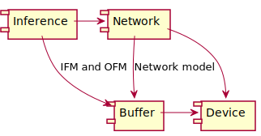
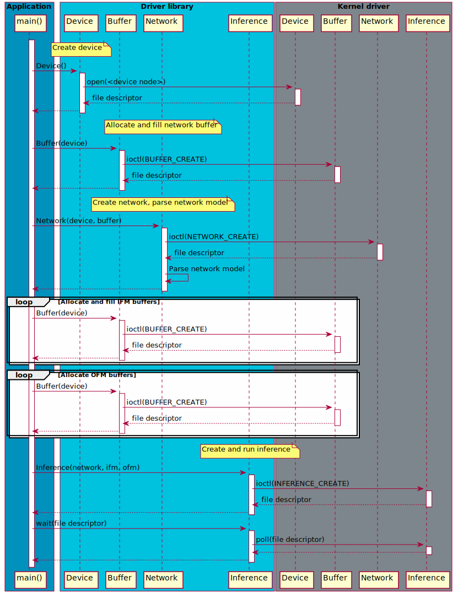
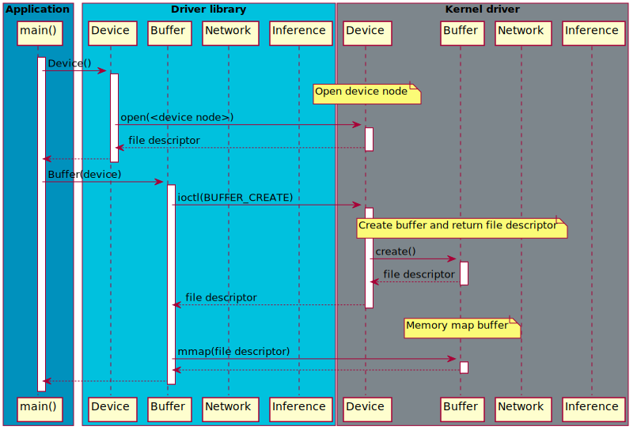
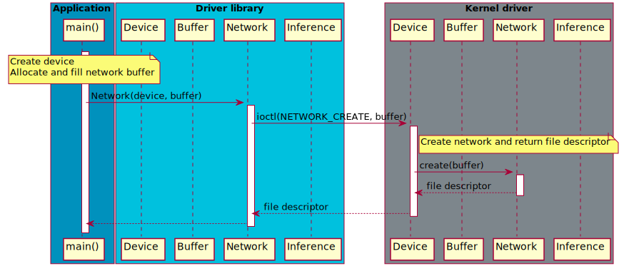
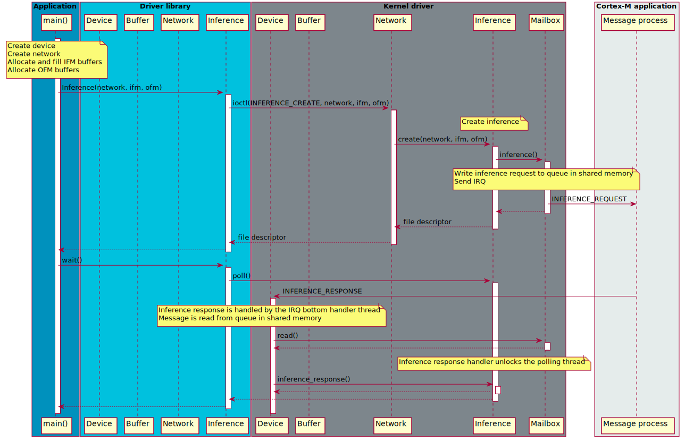

# Linux driver stack for Arm(R) Ethos(TM)-U

The Linux driver stack for Arm(R) Ethos(TM)-U provides an example of how a rich
operating system like Linux can dispatch inferences to an Arm Cortex(R)-M
subsystem, consisting of an Arm Cortex-M of choice and an Arm Ethos-U NPU.

## Building

The driver stack comes with a CMake based build system. Cross compile for an Arm
CPU can for example be done with the provided toolchain file.

```
$ mkdir build
$ cd build
$ cmake .. -DCMAKE_TOOLCHAIN_FILE=../cmake/toolchain/aarch64-linux-gnu.cmake -DKDIR=<Kernel directory>
$ make
```

## DTB

The kernel driver uses the mailbox APIs as a doorbell mechanism.

```
/ {
  reserved-memory {
    #address-cells = <2>;
    #size-cells = <2>;
    ranges;

    ethosu_msg: ethosu_msg@80000000 {
      compatible = "shared-dma-pool";
      reg = <0 0x80000000 0 0x00040000>;
      no-map;
    };

    ethosu_reserved: ethosu_reserved@80040000 {
      compatible = "shared-dma-pool";
      reg = <0 0x80040000 0 0x00040000>;
      no-map;
    };
  };

  ethosu_mailbox: mhu@6ca00000 {
    compatible = "arm,mhu", "arm,primecell";
    reg = <0x0 0x6ca00000 0x0 0x1000>;
    interrupts = <0 168 4>;
    interrupt-names = "npu_rx";
    #mbox-cells = <1>;
    clocks = <&soc_refclk100mhz>;
    clock-names = "apb_pclk";
  };

  ethosu_mcu {
    compatible ="arm, ethosu-sgm775-rproc";
    reg = <0x0 0x500f0000 0x0 0x1000>,
          <0x0 0x50100000 0x0 0x100000>;
    reg-names = "bridge", "firmware";
  };

  ethosu {
    #address-cells = <2>;
    #size-cells = <2>;

    compatible = "arm,ethosu";
    reg = <0 0x80000000 0 0x00010000>,
          <0 0x80010000 0 0x00010000>;
    reg-names = "in_queue", "out_queue";
    memory-region = <&ethosu_reserved>;
    dma-ranges = <0 0x60000000 0 0x80000000 0 0x20000000>;
    mboxes= <&ethosu_mailbox 0>, <&ethosu_mailbox 0>;
    mbox-names = "tx", "rx";
    ethosu-rproc = <&ethosu_mcu>;
  };
};
```

# Documentation

## Driver library

The purpose of the driver library is to provide user friendly C++ APIs for
dispatching inferences to the Ethos-U kernel driver.

As the component diagram below illustrates the network is separated from the
inference, allowing multiple inferences to share the same network. The buffer
class is used to store any data.



The [inference runner](utils/inference_runner/inference_runner.cpp) demonstrates
how to dispatch inferences to the Ethos-U kernel driver. All the steps described
in the sequence diagram below are executed by the `inference_runner`
application.

The `Device` class opens a file descriptor to the device node `/dev/ethosu<nr>`.
This file descriptor is used to issue IOCTL request to kernel space to create
buffers and networks.

The `Network` class uses the `Device` object to create a new network object. The
network model is stored in a `Buffer` that the network parses to discover the
dimensions of the network model.

The `Inference` class uses the `Network` object to create an inference. The
array of IFM `Buffers` need to be populated with data before the inference
object is created.

The inference object must poll the file descriptor waiting for the inference to
complete.



## Ethos-U core interface

The task of the Ethos-U kernel driver is to present a Userspace API (UAPI) to
user space, and to communicate with the Cortex-M in the Ethos-U subsystem.

The communication with the Ethos-U subsystem is based on message passing in
shared memory, and the Linux kernel mailbox APIs for triggering IRQs on the
remote CPU.

The address of the message queues is hard coded in the Cortex-M application, and
configured in the DTB for the kernel driver.

When the kernel driver allocates dynamic memory for the Ethos-U subsystem it
must be able to map a physical address to a bus address. The DTB contains a
`dma-ranges` which define how to remap physical addresses to the Cortex-M
address space.

Triggering IRQs on a remote CPU requires external hardware support, for example
the Arm MHU.

### Device and buffer

The device driver creates a device node at `/dev/ethosu<nr>` that a user space
application can open and issues IOCTL requests to. This is how buffers and
networks are created.

Creating a new buffer returns another file descriptor that can be memory mapped
for reading and/or writing.



### Network

Creating a network assumes that the device node has already been opened, and
that a buffer has been allocated and populated with the network model.

A new network is created by issuing an IOCTL command on the device node file
descriptor. A file descriptor to a buffer - containing the network model - is
passed in the IOCTL data. The network class increases the reference count on the
buffer, preventing the buffer from being freed before the network object has
been destructed.



### Inference

Creating an inference assumes that a network has already been created, IFM
buffers have been allocated and populated with data, and OFM buffers have been
allocated.

A new inference is created by issuing an IOCTL command to the network file
descriptor. An array of IFM and OFM buffers are passed in the IOCTL data, which
reference counts will be increased.

Immediately after the inference object has been created an *inference request*
message is sent to the Cortex-M application. The inference request message is
written to a ring buffer in shared memory, cache maintenance is executed if
necessary, and an IRQ is raised using the Linux mailbox APIs.

On success, a valid file handle is returned to user space. The file handle is
used to wait for the inference to complete.

Once the inference has been calculated on the Ethos-U subsystem, the message
process writes an *inference response* message into the response queue in shared
memory, executes cache maintenance if needed, and raises an IRQ.

On the Linux side the IRQ is handled and cleared. The IRQ bottom handler is a
separate kernel thread responsible for reading the message queue. When the
inference response message is received it updates the status of the inference
and unblocks any waiting user space processes.



# Licenses

The kernel drivers are provided under a GPL v2 license. All other software
componantes are provided under an Apache 2.0 license.

Please see [LICENSE-APACHE-2.0.txt](LICENSE-APACHE-2.0.txt) and
[LICENSE-GPL-2.0.txt](LICENSE-GPL-2.0.txt) for more information.

# Contributions

The Arm Ethos-U project welcomes contributions under the Apache-2.0 license.

Before we can accept your contribution, you need to certify its origin and give
us your permission. For this process we use the Developer Certificate of Origin
(DCO) V1.1 (https://developercertificate.org).

To indicate that you agree to the terms of the DCO, you "sign off" your
contribution by adding a line with your name and e-mail address to every git
commit message. You must use your real name, no pseudonyms or anonymous
contributions are accepted. If there are more than one contributor, everyone
adds their name and e-mail to the commit message.

```
Author: John Doe \<john.doe@example.org\>
Date:   Mon Feb 29 12:12:12 2016 +0000

Title of the commit

Short description of the change.

Signed-off-by: John Doe john.doe@example.org
Signed-off-by: Foo Bar foo.bar@example.org
```

The contributions will be code reviewed by Arm before they can be accepted into
the repository.

# Security

Please see [Security](SECURITY.md).

# Trademark notice

Arm, Cortex and Ethos are registered trademarks of Arm Limited (or its
subsidiaries) in the US and/or elsewhere.
